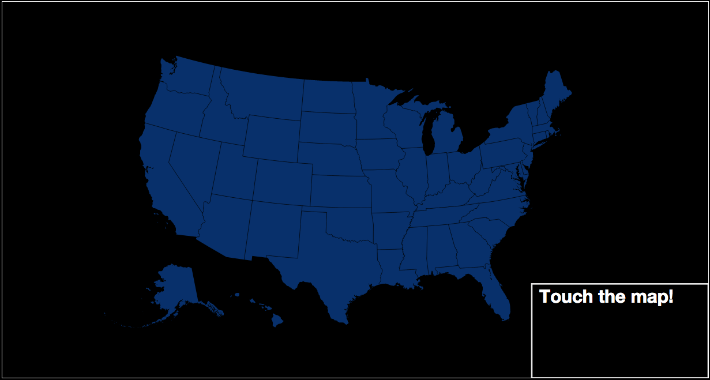
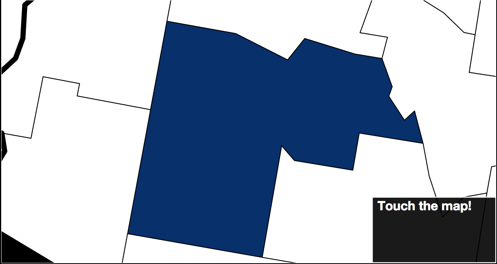

# TNode
* touch your data for the first time

# Why
> This started off as an experiment in using D3 to display tweets collected from a Python script.
> I looked for a way to see Twitter trends on a US map, nothing really tickled me.
> Over time, I added features requiring a true server, settling on NodeJS.  I made it a web framework
> so that people can interact with their data easier. Continue if you like.

# Screenshots
* Welcome Page

* Hover over Area
 
* State Clicked

* County Clicked

# Installation Steps
* Install Postgres, link for download: http://www.postgresql.org/download/
* Install NodeJS, link for downlaoad: https://nodejs.org/en/download/

# Usage Steps
* The app uses data from the Twitter API, here are steps to get credential to use it:
⋅⋅1. Link to get credentials: https://apps.twitter.com/
* Notes on adding credentialsDB and credentialsTwitter
* Note to run npm install
* Notes to run Node app
* Notes to replace Twitter as a data source

# Sources
* Adjusting Points on Zoom: http://jsfiddle.net/o3dxgfuu/12/
* Zoom into State: http://bl.ocks.org/mbostock/2206590
* FIPS code to population and land area data: http://quickfacts.census.gov/qfd/download_data.html
* FIPS code to state, county name: http://www.schooldata.com/pdfs/US_FIPS_Codes.xls
* TopoJSON files for D3 rendering: http://bl.ocks.org/mbostock/raw/4090846/us.json
* Choropleth coloring: http://bl.ocks.org/mbostock/4060606