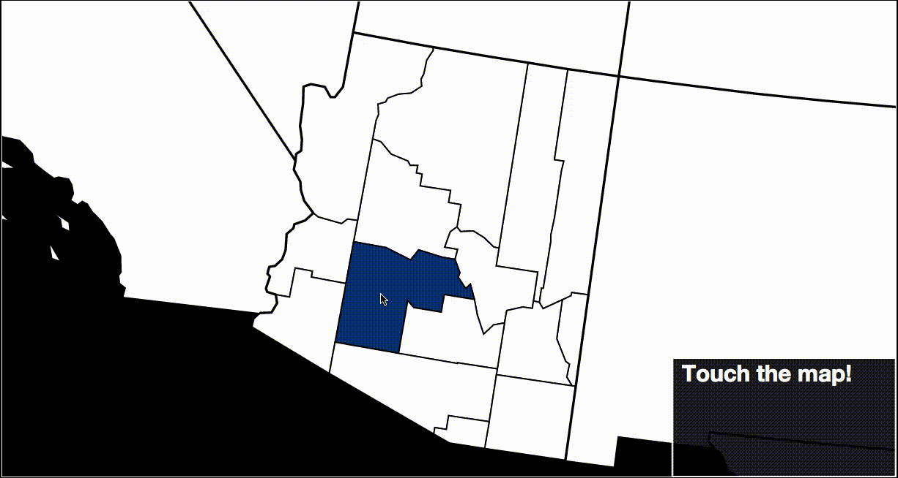

# TNode
Touch your data for the first time!

# Why
This started off as an experiment in using D3 to display tweets collected from a Python script.
I looked for a way to see Twitter trends on a US map, nothing really tickled me.
Over time, I added features requiring a true server, settling on NodeJS for the backend.  I made it a web framework
so that people can interact with their data easier. Continue if you like.
 
# Overview
### Hover over State
 
### State Clicked

### County Clicked

# Installation Steps
* Install Postgres, use the link to download: http://www.postgresql.org/download/
* Install NodeJS, use the link to download: https://nodejs.org/en/download/

# Usage Steps
* The app uses data from the Twitter API, here are steps to get credentials to use it:
<dl>
<dd>1. Sign up for a Twitter account, unless you already have one: https://twitter.com/</dd>
<dd>2. Sign in to the Apps Management Site: https://apps.twitter.com/</dd>
<dd>3. Click on Create New App to continue.</dd>
<dd>4. Fill out the fields for your app and agree to the Developer Agreement. </dd>
<dd>5. Click on Create your Twitter application to continue. </dd>
<dd>6. Click to view the tab called Keys and Access Tokens for the app. </dd>
<dd>7. Click Create my access token on the bottom to continue. </dd>
<dd>7. Create a new file called credentialsTwitter.json. </dd>
<dd>8. Save the file under TNode->router. </dd>
<dd>9. Add a JSON dictionary with the keys: Consumer_Key, Consumer_Secret, Access_Token, and Access_Token_Secret. Then set the values for these keys into the dictionary. Use the tab on Twitter as reference. </dd>
<dd>10. Save the JSON dictionary to the file. </dd>
</dl>
* The app needs a credentialsDB to access your Postgres database:
<dl>
<dd>1. Create a new file called credentialsDB.json. </dd>
<dd>2. Save the file under TNode->router. </dd>
<dd>2. Click on the Postgres application to start the PostgreSQL Server on your machine. </dd>
<dd>3. Open psql, the command line interface for your PostgreSQL server. </dd>
<dd>4. If your server is not password-secured, run the following command:  ALTER ROLE your_username WITH PASSWORD 'your_password'; </dd>
<dd>5. If you haven't made a database yet,  run the following command: CREATE DATABASE your_db_name;</dd>
<dd>6. Add a JSON dictionary with the keys: username, password and dbname. Then set the values for these keys into the dictionary as you set before.</dd>
<dd>7. Save the JSON dictionary to the file. </dd>
</dl>
* To run the app, you have to start the server.js file:
<dl>
<dd>1. Open terminal and cd into the TNode directory. </dd>
<dd>2. To setup nodemon on your machine, run the following command: npm install -g nodemon </dd>
<dd>3. To start the server, run the following command: nodemon server.js </dd>
<dd>4. If it all succeeds, the terminal will say 'the api is running'. </dd>
</dl>

# Contributing
This project can use your help. Submit a pull request or open an issue to get started. For any questions, comments, or concerns, please send me a message at pjkedilaya@gmail.com

# Sources
* Adjusting Points on Zoom: http://jsfiddle.net/o3dxgfuu/12/
* Zoom into State: http://bl.ocks.org/mbostock/2206590
* FIPS code to population and land area data: http://quickfacts.census.gov/qfd/download_data.html
* FIPS code to state, county name: http://www.schooldata.com/pdfs/US_FIPS_Codes.xls
* TopoJSON files for D3 rendering: http://bl.ocks.org/mbostock/raw/4090846/us.json
* Choropleth coloring: http://bl.ocks.org/mbostock/4060606
